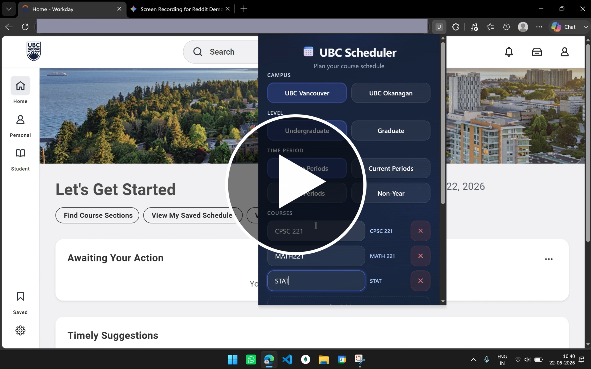

# Workday Scheduler

A Chrome extension that turns Workday course browsing into a conflict-free weekly timetable — scrape sections, generate schedules, tweak them on a visual calendar, and save what you like.

<div align="center">

  
  

  <br>

  <a href="https://youtu.be/1QKfijHx1Zs?si=oVkqx5T9KTPLyczU" target="_blank">
    
  </a>
  
  <p><i>Click the thumbnail above to watch the demo</i></p>
</div>

---


## Features

- **Workday scraping** — Enter campus, level, term, year, and course codes; the extension navigates Workday and pulls lecture, lab, and discussion sections for you.
- **Smart schedule generation** — Backtracking finds valid combinations that avoid time conflicts, with scoring for gaps and campus days.
- **Interactive calendar** — Week grid with overlapping-section layout, section details, and drag-and-drop to swap alternatives.
- **Saved schedules** — Name and store multiple plans locally; reopen them from the popup or calendar.
- **Workday handoff** — Push a saved plan back toward Workday registration automation from the calendar or popup.

Data stays on your machine via `chrome.storage` — nothing is sent to a third-party server.

---

## Requirements

- Google Chrome (or another Chromium browser that supports Manifest V3)
- An active UBC Workday session at `*.myworkday.com`
- Permission to install unpacked extensions (Developer mode)

---

## Install (unpacked)

1. Clone this repository:
   ```bash
   git clone https://github.com/irealyash/workday-schedule-automator.git
   cd workday-schedule-automator
   ```
2. Open Chrome → `chrome://extensions`
3. Enable **Developer mode**
4. Click **Load unpacked** and select this repository’s **root** folder (the one that contains `manifest.json`)
5. Pin **UBC Scheduler** from the extensions menu

---

## How to use

1. Sign in to [UBC Workday](https://www.myworkday.com/) and leave that tab open.
2. Open the extension popup.
3. Choose **campus**, **level**, **time period**, **academic year**, and **term**.
4. Add course codes (e.g. `CPSC 121`, `MATH 101`).
5. Click **Generate Schedules** — the content script scrapes Workday, then opens the calendar view.
6. Review the timetable, drag sections if needed, and **Save** named plans.
7. Use **Add to Workday** from Saved Schedules when you are ready to register.

---

## Project structure

Extension entry points stay at the repo root. UI and scripts live under `src/`.

```
.
├── manifest.json              # Manifest V3 — points into src/
├── README.md
├── .gitignore
├── storage.md                 # Storage keys & data-flow reference
├── assets/                    # Project media
│   ├── thumbnail.png          # Video thumbnail for README
│   └── demo.mp4         # Main walkthrough video
└── src/
    ├── popup.html             # Extension popup UI
    ├── popup.css
    ├── calendar.html          # Full-page calendar UI
    ├── calendar.css
    └── js/
        ├── background.js      # Service worker (tabs, open calendar)
        ├── navigation.js      # Workday content script / scraping
        ├── popup.js           # Popup form + Generate Schedules
        ├── calendar.js        # Calendar UI, save, drag handlers
        ├── finale.js          # Workday handoff from saved schedules
        ├── scheduler.js       # Conflict-aware schedule engine
        ├── state.js           # Calendar in-memory app state
        ├── storage.js         # Popup storage helpers
        ├── storage2.js        # Calendar storage helpers
        ├── layoutEngine.js    # Overlap layout for calendar blocks
        ├── dragManager.js     # Drag-and-drop section swaps
        ├── scheduleValidator.js
        ├── savedSchedulesManager.js
        ├── navigation2.js
        └── onlyforNavigation.js
```

---

## Architecture (short)

```
src/popup.html (popup.js)
    → chrome.storage (workspace draft)
    → content script on Workday (src/js/navigation.js)
    → scraped sections written to chrome.storage.local
    → background (src/js/background.js) opens src/calendar.html
    → ScheduleEngine + calendar UI (src/js/calendar.js)
```

There is no custom backend. The bridge between Workday and the calendar is shared extension storage plus background messaging. See [`storage.md`](./storage.md) for keys and shapes.

---

## Permissions

| Permission | Why |
|---|---|
| `storage` | Form drafts, scraped courses, saved schedules |
| `scripting` / `activeTab` / `tabs` | Talk to Workday tabs and open the calendar |
| `https://*.myworkday.com/*` | Run the content script on Workday only |

---

## Disclaimer

UBC Scheduler is an independent student project. It is **not** affiliated with, endorsed by, or supported by The University of British Columbia or Workday, Inc. Course availability and registration rules can change; always confirm sections in official Workday before registering. Use responsibly and in line with UBC’s acceptable-use policies.

---

## Contributing

Issues and pull requests are welcome. Please keep changes focused, avoid committing secrets or personal Workday data, and test with **Load unpacked** before opening a PR.

---

## License

No license file is attached yet. If you fork or redistribute, contact the author or add an explicit license before publishing derivatives.
